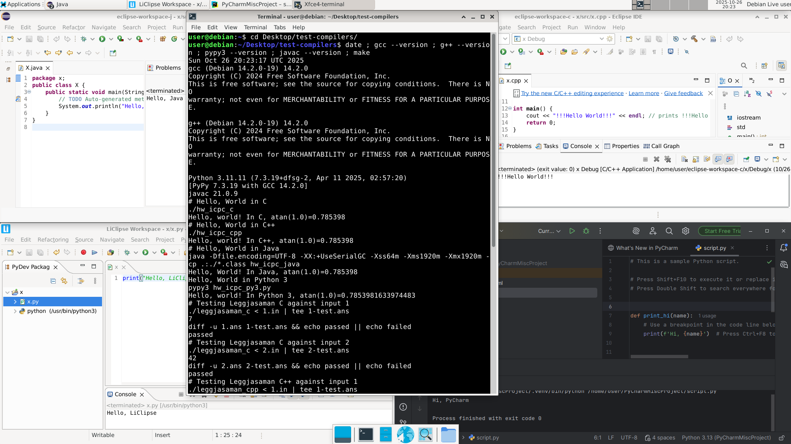

# A Debian-based LiveCD builder for ICPC

Summary:
a 64-bit Debian Live installation for the International Collegiate Programming Competition (ICPC).

Includes: gcc, g++, Java, Python 3, Eclipse (for C, C++, Java, and Python), PyCharm, Visual Studio Code, Vim, Emacs, gdb.
Locked down to prevent user administrative access, and limits all outbound network traffic to a preconfigured Squid proxy server.
Currently preconfigured for the US Mid-Central region proxy server, and only administerable via root ssh key.

System requirements:

- Debian amd64 installation (tested on 13.0, may work on earlier versions)

Basic Usage:

1. Read through `build.sh` and the files under `debian-live/config`.
2. Run `./build.sh` or `./build.sh allow-internet` as root (unprivileged builds will come later).
3. Copy the resulting `live-image-amd64.hybrid.iso` to media and boot.

**The `allow-internet` build will allow full outbound Internet access for teams to practice with, and should not be used for an actual contest.**

You may have to remove the `~/icpc` directory before making a new build. The included `Vagrantfile` does this automatically as part of provisioning.

Administration:

1. For normal usage, replace the `authorized_keys` file in `debian-live/config/includes.chroot/root/.ssh` and rebuild the image.
2. If you need to install other packages on the live system, or otherwise need network access, run `shorewall stop` to disable the firewall, and unset the needed the `*proxy` variables that were set from `/etc/environment`: `http_proxy`, `https_proxy`, `ftp_proxy`, `HTTP_PROXY`, `HTTPS_PROXY`, `FTP_PROXY`. Once you're done, restart shorewall with `shorewall start`.

References:

- [Debian Live Manual](https://live-team.pages.debian.net/live-manual/)
- [Debian Wiki: DebianLive](https://wiki.debian.org/DebianLive)
